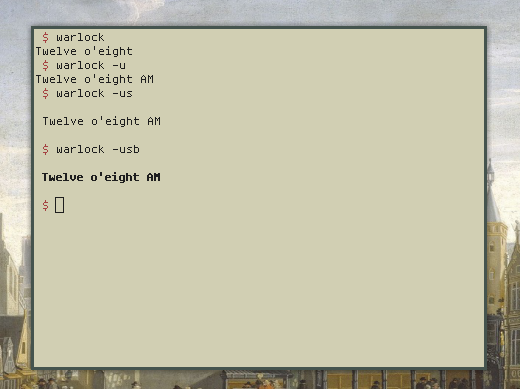

<h1 align="center">plain 🕰️</h1>

<p align="center">A simple plain english clock</p>

<p align="center"></p>

# Dependencies

```
go get -u github.com/geremachek/escape
```

```
go get -u github.com/spf13/pflag
```

# What is it?
 
A command that displays the time in plain english.
i.e. ```Elven fifty-four AM```

# Usage

```
Usage: plain [OPTION]...
A simple plain english clock

--help, -h: Display this information
-u: Use the U.S. standard AM/PM time
-s: Put spacing around the text
-b: Use bold text`
```
